C-POD data workshop: Data preparation and exploration
================
VLIZ - Flanders Marine Institute
October 5-6, 2017

Data exploration is a vital aspect of statistical analysis and provides crucial insight in the information and patterns of the data.This document demonstrates some useful code for basic data exploration and organisation.

0. Load the data
----------------

Defining a working directory facilitates the access to folders and documents. This can be done by creating an R project or by code setwd().

``` r
getwd() # Check your current working directory.
list.files() # See the files in your working directory
```

In the folder **Data**, you can find several data tables, downloaded from the RShiny application. The names indicate the quality of the detected porpoise clicks.

``` r
list.files("Data")
```

    ## [1] "hi_mod_1hr.tab"     "Hour2016.tab"       "Lifewatch Citation"
    ## [4] "Mapping"            "Metadata"           "poddata_day.csv"

The file **hi\_mod\_1hr.tab** contains the detections of quality hi and mod pooled together for each hour. We will use this file for this session.

Importing the data is possible by code or by the 'Import Dataset' button in the Environment window on the right.

``` r
poddata <- read.table("Data/hi_mod_1hr.tab", "\t", header = T)
```

1. Data preparation
-------------------

``` r
str(poddata) # Investigate the structure of the object poddata.
```

    ## 'data.frame':    54742 obs. of  15 variables:
    ##  $ Deployment_fk         : int  2573 2573 2573 2573 2573 2573 2573 2573 2573 2573 ...
    ##  $ Time                  : Factor w/ 20000 levels "2014-06-23 00:00:00",..: 1 2 3 4 5 6 7 8 9 10 ...
    ##  $ Species               : Factor w/ 1 level "NBHF": 1 1 1 1 1 1 1 1 1 1 ...
    ##  $ Milliseconds          : int  0 0 0 0 0 0 0 0 0 0 ...
    ##  $ Number_clicks_filtered: int  0 0 0 0 0 0 0 0 0 0 ...
    ##  $ Number_clicks_total   : int  0 0 0 0 0 0 0 0 10760 0 ...
    ##  $ Lost_minutes          : int  0 0 0 0 0 0 0 0 2 0 ...
    ##  $ Recorded              : int  0 0 0 0 0 0 0 0 6 0 ...
    ##  $ Dpm                   : int  0 0 0 0 0 0 0 0 0 0 ...
    ##  $ Dp10m                 : int  0 0 0 0 0 0 0 0 0 0 ...
    ##  $ Station               : Factor w/ 16 levels "bpns-Belwind C05",..: 5 5 5 5 5 5 5 5 5 5 ...
    ##  $ Latitude              : num  51.6 51.6 51.6 51.6 51.6 ...
    ##  $ Longitude             : num  2.98 2.98 2.98 2.98 2.98 ...
    ##  $ Mooring_type          : Factor w/ 2 levels "bottom-mooring",..: 2 2 2 2 2 2 2 2 2 2 ...
    ##  $ Receiver              : Factor w/ 16 levels "POD-2420","POD-2421",..: 4 4 4 4 4 4 4 4 4 4 ...

Some explanation on the different variables: - *Deployment\_fk* = An identifying number assigned to each deployment - *Time* = Date and time - *Species* = NBHF (Narrow Band High Frequency) - *Milliseconds* = The sum of milliseconds in which a porpoise was detected - *Number\_clicks\_filtered* = The amount of clicks, identified as porpoise clicks - *Number\_clicks\_total* = The total amount of clicks, from different sources - *Lost\_minutes* = The number of minutes for which the C-POD reached a detection threshold and recorded the minute only partially. - *Recorded* = The number of minutes that the C-POD was on. - *Dpm* = The sum of Detection Positive Minutes. - *Dp10m* = The sum of Detection Positive 10 Minutes. - *Station* = The name of the station. - *Latitude* - *Longitude* - *Mooring\_type* = Indicates whether the C-POD was deployed on a surface-buoy or a bottom mooring. - *Receiver* = The name of the receiver.

A first exploration with the **str()** function already indicates some issues and possibilites for improvement:

-   *Receiver*, *Station*, *Mooring\_type* and *Species* are considered character variables.

-   *Time* is considered a factor, while is a time variable.

### 1.1 Organizing the data and adding relevant variables

Adding the variable quality might be useful for future reference.

``` r
poddata$Quality <- "hi+mod"
```

Detection positive hour, *Dph*, will indicate whether there was a detection within the hour (1) or not (0).

``` r
poddata$Dph <- ifelse(poddata$Dpm >0, 1, 0)
```

The exact locations for some C-POD deployments changed slightly over the years. Adding a variable *Zone* will be useful to link the data of adjacent stations.

``` r
poddata$Zone<- ifelse(poddata$Station=="bpns-Oostendebank Oost", "Oostende",
              ifelse(poddata$Station=="bpns-Reefballs-cpower", "bnps-Reefballs-cpower",
              ifelse(poddata$Station== "bpns-Wenduinebankw", "Oostende",
              ifelse(poddata$Station=="bpns-WK16", "Oostende",
              ifelse(poddata$Station=="bpns-Belwind C05", "bpns-Belwind C05",
              ifelse(poddata$Station== "bpns-D1", "Middelkerke",
              ifelse(poddata$Station=="bpns-WK9", "WK9en12",
              ifelse(poddata$Station=="bpns-Gootebank", "Gootebank",
              ifelse(poddata$Station=="bpns-VG2" , "Gootebank",
              ifelse(poddata$Station== "bpns-WK12", "WK9en12",
              ifelse(poddata$Station== "bpns-Reefballs Belwind", "bpns-Reefballs Belwind",
              ifelse(poddata$Station==  "bpns-Oostdyck West",  "bpns-Oostdyck West", 
              ifelse(poddata$Station== "bpns-LST420", "Middelkerke",
              ifelse(poddata$Station== "bpns-Middelkerke South", "Middelkerke",
              ifelse(poddata$Station== "bpns-Lottobuoy", "bpns-Lottobuoy",
              ifelse(poddata$Station== "bpns-Birkenfels", "bpns-Birkenfels", NA))))))))))))))))
```

Click frequency (also called PPM, Porpoise Positive Minutes) and Click intensity are common metrics in acoustic porpoise research.

``` r
poddata$Click_frequency <- poddata$Dpm/poddata$Recorded
poddata$Click_intensity <- poddata$Number_clicks_filtered/poddata$Click_frequency
```

Understanding the content of a variable, we can assign an appropriate data type.

``` r
poddata$Receiver <- as.factor(poddata$Receiver)
poddata$Station <- as.factor(poddata$Station)
poddata$Mooring_type <- as.factor(poddata$Mooring_type)
poddata$Quality <- as.factor(poddata$Quality)
poddata$Species <- as.factor(poddata$Species)
poddata$Zone <- as.factor(poddata$Zone)
```

The [lubridate](https://cran.r-project.org/web/packages/lubridate/lubridate.pdf) package provides some useful tools to handle dates and times.

``` r
library(lubridate)
```

To install a package use the **install.packages()** function.

Some explanation on the package:

``` r
today()
```

    ## [1] "2018-03-27"

``` r
now()
```

    ## [1] "2018-03-27 16:07:54 CEST"

``` r
moonlanding <- "24-07-1969 16:50:35"
```

``` r
moonlanding <- parse_date_time(moonlanding, orders = "dmy HMS")
```

The **parse\_date\_time()** function transforms the character variable to the POSIXct format, enabling you to extract features of time from the variable (eg. **year()**, **month()**, **day()**, **hour()**, **minute()**). Be careful to specify the *orders* argument correctly! For example: in these data, datetime was in a different format than the installation and activation dates.

``` r
day(moonlanding)
```

    ## [1] 24

``` r
date(moonlanding)
```

    ## [1] "1969-07-24"

We can now transform our own variable *Time*.

``` r
poddata$Time <- parse_date_time(poddata$Time, orders = "ymd HMS")
```

The summary function gives a quick peek at our data.

``` r
summary(poddata)
```

    ##  Deployment_fk       Time                     Species     
    ##  Min.   :2554   Min.   :2014-06-23 00:00:00   NBHF:54742  
    ##  1st Qu.:2578   1st Qu.:2016-04-28 04:00:00               
    ##  Median :2587   Median :2016-10-04 10:00:00               
    ##  Mean   :2589   Mean   :2016-08-20 09:46:23               
    ##  3rd Qu.:2597   3rd Qu.:2017-02-11 09:00:00               
    ##  Max.   :2626   Max.   :2017-08-09 12:00:00               
    ##                                                           
    ##   Milliseconds    Number_clicks_filtered Number_clicks_total
    ##  Min.   :     0   Min.   :    0.00       Min.   :     0     
    ##  1st Qu.:     0   1st Qu.:    0.00       1st Qu.:  8926     
    ##  Median :     0   Median :    0.00       Median : 59278     
    ##  Mean   :  2552   Mean   :   98.25       Mean   : 99658     
    ##  3rd Qu.:   429   3rd Qu.:   18.00       3rd Qu.:214452     
    ##  Max.   :352309   Max.   :17679.00       Max.   :245760     
    ##                                                             
    ##   Lost_minutes      Recorded          Dpm              Dp10m       
    ##  Min.   : 0.00   Min.   : 0.00   Min.   :  0.000   Min.   :0.0000  
    ##  1st Qu.: 0.00   1st Qu.:60.00   1st Qu.:  0.000   1st Qu.:0.0000  
    ##  Median : 0.00   Median :60.00   Median :  0.000   Median :0.0000  
    ##  Mean   :16.01   Mean   :55.23   Mean   :  2.024   Mean   :0.6029  
    ##  3rd Qu.:33.00   3rd Qu.:60.00   3rd Qu.:  1.000   3rd Qu.:1.0000  
    ##  Max.   :60.00   Max.   :60.00   Max.   :104.000   Max.   :6.0000  
    ##                                                                    
    ##                    Station         Latitude       Longitude    
    ##  bpns-Reefballs Belwind:10628   Min.   :51.23   Min.   :2.439  
    ##  bpns-WK9              : 7338   1st Qu.:51.29   1st Qu.:2.813  
    ##  bpns-Reefballs-cpower : 5881   Median :51.46   Median :2.865  
    ##  bpns-Gootebank        : 5134   Mean   :51.48   Mean   :2.869  
    ##  bpns-Oostendebank Oost: 4498   3rd Qu.:51.58   3rd Qu.:2.995  
    ##  bpns-Lottobuoy        : 3576   Max.   :51.70   Max.   :3.107  
    ##  (Other)               :17687                                  
    ##          Mooring_type       Receiver       Quality           Dph        
    ##  bottom-mooring:13247   POD-2729: 7133   hi+mod:54742   Min.   :0.0000  
    ##  surface-buoy  :41495   POD-2724: 6835                  1st Qu.:0.0000  
    ##                         POD-2421: 5983                  Median :0.0000  
    ##                         POD-2725: 4858                  Mean   :0.2969  
    ##                         POD-2422: 4737                  3rd Qu.:1.0000  
    ##                         POD-2730: 3795                  Max.   :1.0000  
    ##                         (Other) :21401                                  
    ##                      Zone       Click_frequency  Click_intensity  
    ##  bpns-Reefballs Belwind:10628   Min.   :0.0000   Min.   :   36.0  
    ##  WK9en12               : 8670   1st Qu.:0.0000   1st Qu.:  902.3  
    ##  Gootebank             : 8114   Median :0.0000   Median : 1560.0  
    ##  Oostende              : 7357   Mean   :0.0362   Mean   : 2010.2  
    ##  Middelkerke           : 5945   3rd Qu.:0.0167   3rd Qu.: 2610.0  
    ##  bnps-Reefballs-cpower : 5881   Max.   :2.0000   Max.   :25290.0  
    ##  (Other)               : 8147   NA's   :429      NA's   :38487

### 1.2 Data subsetting

Subset the data with generic R code: some examples.

``` r
poddata[1,]
```

``` r
poddata[1:5,]
```

``` r
poddata[,1]
```

``` r
poddata[,c(2,4)]
```

``` r
unique(poddata$Station) 
poddata[poddata$Station == "bpns-Lottobuoy",]
```

The R package [dplyr](https://cran.r-project.org/web/packages/dplyr/dplyr.pdf) provides useful functions for data organization.

``` r
library(dplyr)
```

The **select()** function allows for a straightforward selection of columns ([useful select syntaxis](https://www.rdocumentation.org/packages/dplyr/versions/0.5.0/topics/select)).

``` r
select(poddata, Receiver)
select(poddata, -Receiver)
select(poddata, Station, Latitude, Longitude)
```

The filter function allows for subsetting of rows. The equivalent function for rows is **filter()** ([useful filter syntaxis](https://www.rdocumentation.org/packages/dplyr/versions/0.7.2/topics/filter)).

``` r
filter(poddata, Station == "bpns-Lottobuoy")
filter(poddata, Station == "bpns-Lottobuoy" | Station == "bpns-WK12")
filter(poddata, Station != "bpns-Lottobuoy")
filter(poddata, Dpm > 0)
filter(poddata, Dpm > 0 & Station == "bpns-Lottobuoy")
```

Side note: some function names of dplyr are identical to function names of other packages. This can cause an error when using the function. In this case, write the package name and :: before the function.

``` r
dplyr::select(poddata, Receiver)
```

Side note: this can be combined with the lubridate functions.

``` r
filter(poddata, year(Time) == 2017)
```

A value of zero for the variable Recorded indicates the C-POD was not 'on' during the entire hour. Hence, we can filter out these rows.

``` r
poddata <- filter(poddata, Recorded > 0)
```

A value of 60 for the variable Recorded indicates the C-POD was not 'on' for some minutes during the hour. We can choose whether to filter out these rows.

``` r
poddata <- filter(poddata, Recorded == 60)
```

### 1.3 Summarizing data

Combining the functions group\_by and summarise allows for simple organization: an example.

First, we group our dataframe by *Zone*.

``` r
poddata_group <- group_by(poddata, Zone)
```

``` r
groups(poddata_group) # Check the grouping variable
```

    ## [[1]]
    ## Zone

Next, we can calculate some summary statistics for each *Zone* seperately.

``` r
poddata_sum <- summarise(poddata_group,
                         Dpm_median = median(Dpm),
                         Dpm_mean = mean(Dpm),
                         Dpm_max = max(Dpm))
```

``` r
poddata_sum
```

    ## # A tibble: 10 x 4
    ##    Zone                   Dpm_median Dpm_mean Dpm_max
    ##    <fctr>                      <dbl>    <dbl>   <dbl>
    ##  1 bnps-Reefballs-cpower        1.00   4.55    104   
    ##  2 bpns-Belwind C05             0      0.538    23.0 
    ##  3 bpns-Birkenfels              0      0.0137    1.00
    ##  4 bpns-Lottobuoy               0      1.11     65.0 
    ##  5 bpns-Oostdyck West           0      1.62     53.0 
    ##  6 bpns-Reefballs Belwind       0      3.70     88.0 
    ##  7 Gootebank                    0      2.00     71.0 
    ##  8 Middelkerke                  0      1.98     96.0 
    ##  9 Oostende                     0      0.582    46.0 
    ## 10 WK9en12                      0      2.46    100

``` r
rm(poddata_group, poddata_sum) # Remove the example data frames
```

We will now apply these functions to get a new data frame that summarizes the detections per day.

``` r
poddata_day <- poddata # Copy the data in a new data frame.
```

Three ways to take the date out of our time variable. Using the lubridate::date() function is very elegant, HOWEVER: lubridate has some bugs when combined with the packages dplyr/plyr.

``` r
poddata_day$Time <- date(poddata_day$Time)
poddata_day$Time <- parse_date_time(paste(year(poddata$Time), month(poddata$Time), day(poddata$Time), sep = "-"), orders = "ymd")
poddata_day$Time <- as.POSIXct(paste(year(poddata$Time), month(poddata$Time), day(poddata$Time), sep = "-"),format="%Y-%m-%d", tz="UTC")
```

Now we can group by Time.

``` r
poddata_group <- dplyr::group_by(poddata_day, Deployment_fk, Receiver, Station, Zone, Latitude, Longitude, Mooring_type, Quality, Time)
poddata_day <- dplyr::summarise(poddata_group,
                         Milliseconds = sum(Milliseconds),
                         Number_clicks_filtered = sum(Number_clicks_filtered),
                         Number_clicks_total = sum(Number_clicks_total),
                         Lost_minutes = sum(Lost_minutes),
                         Dpm = sum(Dpm),
                         Dp10m = sum(Dp10m),
                         Dph = sum(Dph),
                         Recorded = sum(Recorded))
poddata_day$Click_frequency <- poddata_day$Dpm/poddata_day$Recorded
poddata_day$Click_intensity <- poddata_day$Number_clicks_filtered/poddata_day$Click_frequency
rm(poddata_group)
```

Again, we can choose to only use full days.

``` r
poddata_day <- filter(poddata_day, Recorded == 24*60)
```

2. Data exploration
-------------------

The R package [ggplot2](https://cran.r-project.org/web/packages/ggplot2/ggplot2.pdf) enables the construction of complex, illustrious graphs with simple code ([useful ggplot syntax](http://ggplot2.tidyverse.org/reference/)). We will first use this to make simple plots for exploration and later apply more advanced plotting techniques.

``` r
library(ggplot2)
```

### 2.1 A first look at the data availability

Making a graph in ggplot: an example to test the data availability.

``` r
ggplot(data = poddata_day, aes(x= Time, y = Quality)) # This makes an empty plot
```

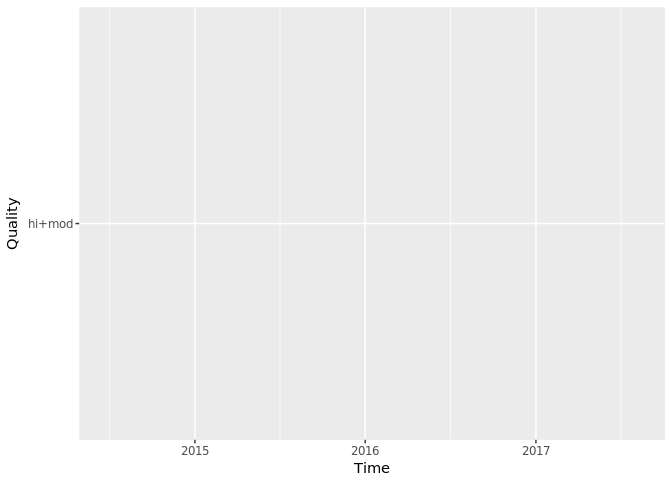

Three ways to code the same plot.

``` r
ggplot(data = poddata_day, aes(x= Time, y = Quality)) + geom_point()
```

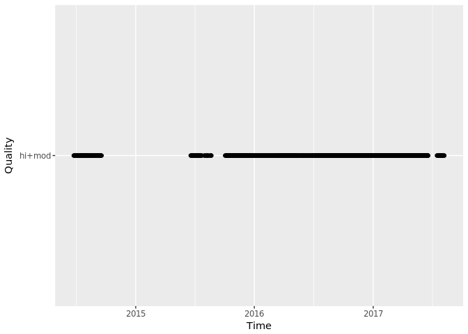

``` r
ggplot() + geom_point(data = poddata_day, aes(x= Time, y = Quality))
```


``` r
ggplot(data = poddata_day) + geom_point(aes(x= Time, y = Quality))
```


Now we can investigate the data availability per station.

``` r
ggplot(data = poddata_day) + geom_point(aes(x= Time, y = Station))
```

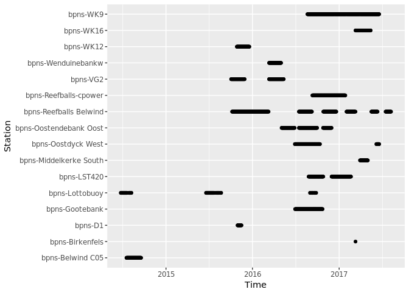

Same for zones. By defining the theme argument, we can change the graphics of our plot.

``` r
ggplot(data = poddata_day) + geom_point(aes(x= Time, y = Zone)) + 
  theme_bw() + 
  theme(axis.text = element_text(size = 16),
        axis.title = element_blank())
```

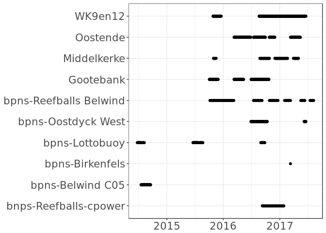

### 2.2 In line with Zuur's protocol for data exploration

In the next steps, we will visually explore the data in line with the first four steps of Zuur's protocol.

### 2.2.1 Step 1: Are there outliers in Y and X?

Construct a basic boxplot to visualize the spread of the data and check for outliers.

``` r
ggplot(data = poddata_day) + 
  geom_boxplot(aes(x = factor(0), y = Dpm), fill="#008EAA") + 
  theme_bw() +
  theme(axis.title = element_text(size = 20),
        axis.text = element_text(size = 16),
        axis.title.x = element_blank()) +
  labs(y = "DPM per day")
```

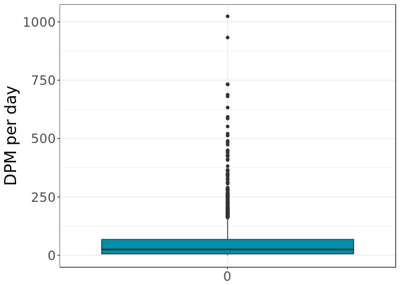

``` r
ggplot(data = poddata_day) + 
  geom_boxplot(aes(x = factor(0), y = Click_frequency), fill="#008EAA") + 
  theme_bw() +
  theme(axis.title = element_text(size = 20),
        axis.text = element_text(size = 16),
        axis.title.x = element_blank()) +
  labs(y = "Click frequency per day")
```

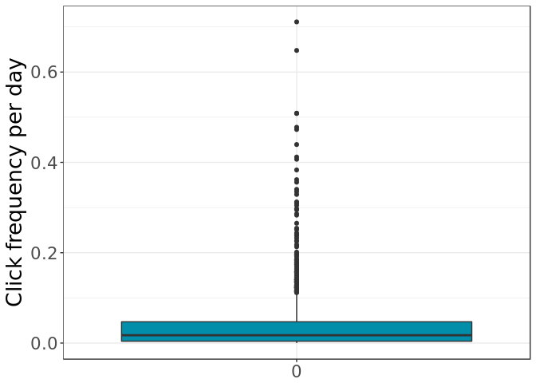

We can do the same for Dp10m and Dph.

``` r
ggplot(data = poddata_day) + 
  geom_boxplot(aes(x = factor(0), y = Dp10m), fill="#008EAA") + 
  theme_bw() +
  theme(axis.title = element_text(size = 20),
        axis.text = element_text(size = 16),
        axis.title.x = element_blank()) +
  labs(y = "DP10M per day")
```

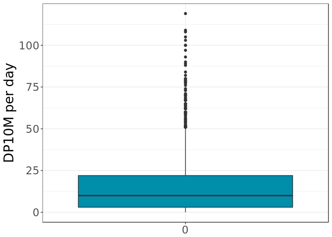

``` r
ggplot(data = poddata_day) + 
  geom_boxplot(aes(x = factor(0), y = Dph), fill="#008EAA") + 
  theme_bw() +
  theme(axis.title = element_text(size = 20),
        axis.text = element_text(size = 16),
        axis.title.x = element_blank()) +
  scale_y_continuous(limits = c(0,24), breaks = c(0, 4, 8, 12, 16, 20, 24)) + 
  labs(y = "DPH per day")
```

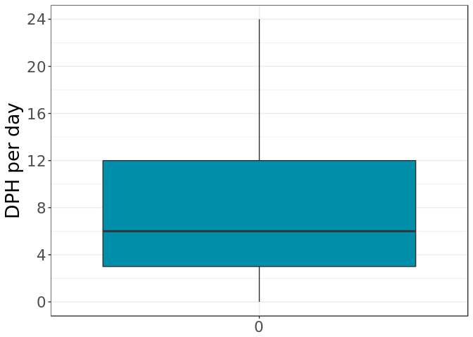

Cleveland dotplots allow for a further inspection of outliers.

``` r
ggplot(data = poddata_day) + 
  geom_point(aes(x= Dpm, y = Time)) +
  theme_bw() + 
  theme(axis.title = element_text(size = 20),
        axis.title.y = element_blank(),
        axis.text = element_text(size = 16),
        legend.title = element_blank()) +
  labs(x = "DPM per day")
```

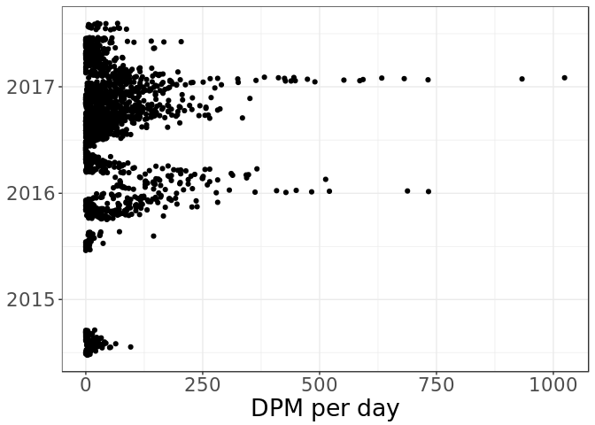

``` r
ggplot(data = poddata_day) + 
  geom_point(aes(x= Dpm, y = Station)) +
  theme_bw() + 
  theme(axis.title = element_text(size = 20),
        axis.title.y = element_blank(),
        axis.text = element_text(size = 16),
        legend.title = element_blank()) +
  labs(x = "DPM per day")
```

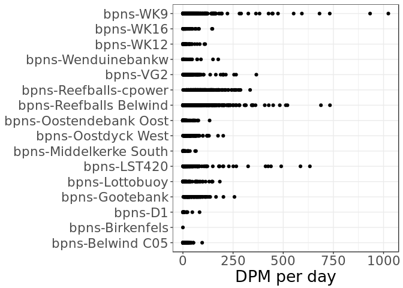

``` r
ggplot(data = poddata_day) + 
  geom_point(aes(x= Dpm, y = Zone)) +
  theme_bw() + 
  theme(axis.title = element_text(size = 20),
        axis.title.y = element_blank(),
        axis.text = element_text(size = 16),
        legend.title = element_blank()) +
  labs(x = "DPM per day")
```

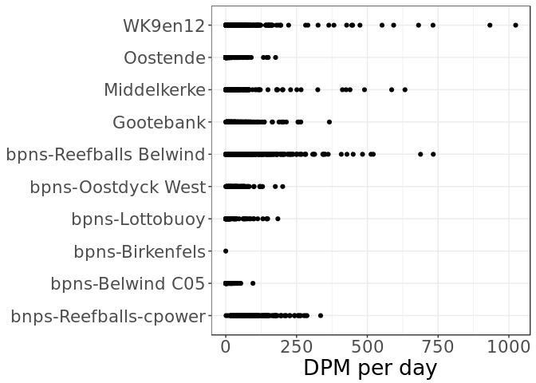

### 2.2.2 Step 2: Do we have homogeneity of variance?

To check for homogeinity of variance, we can make conditional boxplots.

``` r
ggplot(data = poddata_day) + 
  geom_boxplot(aes(x = as.factor(month(Time)), y = Dpm), fill="#008EAA") + 
  theme_bw() +
  theme(axis.title = element_text(size = 20),
        axis.text = element_text(size = 16),
        axis.title.x = element_blank()) +
  labs(y = "DPM per day")
```

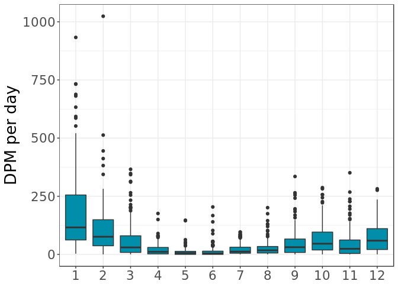

``` r
ggplot(data = poddata_day) + 
  geom_boxplot(aes(x = Zone, y = Dpm), fill="#008EAA") + 
  theme_bw() +
  theme(axis.text.x = element_text(angle = 45, hjust = 1),
        axis.title = element_text(size = 20),
        axis.text = element_text(size = 16),
        axis.title.x = element_blank()) +
  labs(y = "DPM per day")
```

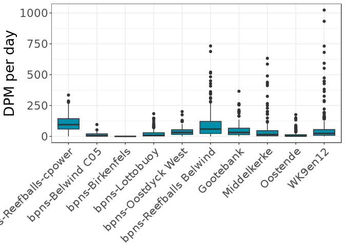

Additionally, the data distribution can be explored per month or station with the *facet\_wrap()* argument.

``` r
ggplot(data = poddata_day) + 
  geom_boxplot(aes(x = as.factor(month(Time)), y = Dpm), fill="#008EAA") + 
  theme_bw() +
  theme(axis.title = element_text(size = 20),
        axis.text = element_text(size = 14),
        axis.title.x = element_blank(),
        axis.text.x = element_text(angle = 45, hjust = 1)) +
  labs(y = "DPM per day") + 
  facet_wrap(~Zone)
```

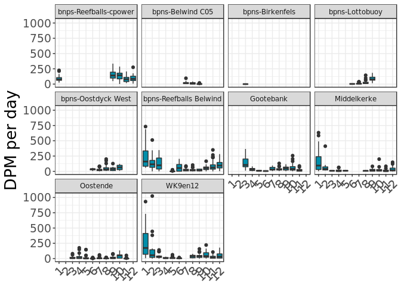

### 2.2.3 Step 3: Are the data normally distributed?

Although we can already suspect the data are not normally distributed, a histogram can shed light on the distribution of a variable.

``` r
ggplot(data = poddata_day) + 
  geom_histogram(aes(x = Dpm), fill="#008EAA") + 
  theme_bw() + 
  theme(axis.title = element_text(size = 20),
        axis.title.y = element_blank(),
        axis.text = element_text(size = 16),
        legend.title = element_blank()) +
  labs(x = "DPM per day")
```

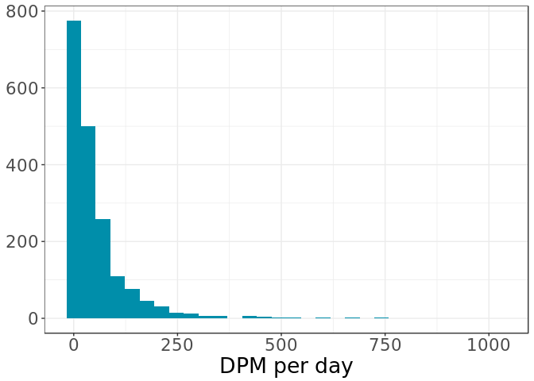

``` r
ggplot(data = poddata_day) + 
  geom_histogram(aes(x = Dpm), fill="#008EAA",binwidth = 10) + 
  theme_bw() + 
  theme(axis.title = element_text(size = 20),
        axis.title.y = element_blank(),
        axis.text = element_text(size = 16),
        legend.title = element_blank()) +
  labs(x = "DPM per day")
```

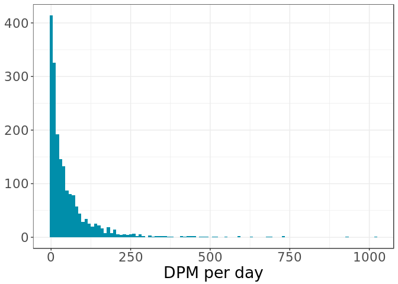

``` r
ggplot(data = poddata_day) + 
  geom_histogram(aes(x = Dpm), fill="#008EAA",binwidth = 10) + 
  theme_bw() + 
  theme(axis.title = element_text(size = 20),
        axis.title.y = element_blank(),
        axis.text = element_text(size = 16),
        legend.title = element_blank()) +
  labs(x = "DPM per day")
```


### 2.2.4 Step 4: Are there lots of zeros in the data?

Next, Zuur advises to make a frequency plot to check for the amount of zeros in the data. The geom\_rug argument facilitates the

``` r
ggplot(data = poddata_day) + 
  geom_histogram(aes(x = Dpm), fill="#008EAA", binwidth = 1, position = "dodge", size = 0.5) +
  geom_rug(aes(x = Dpm))+
  theme_bw() + 
  theme(axis.title = element_text(size = 20),
        axis.title.y = element_blank(),
        axis.text = element_text(size = 16),
        legend.title = element_blank()) +
  labs(x = "DPM per day")
```

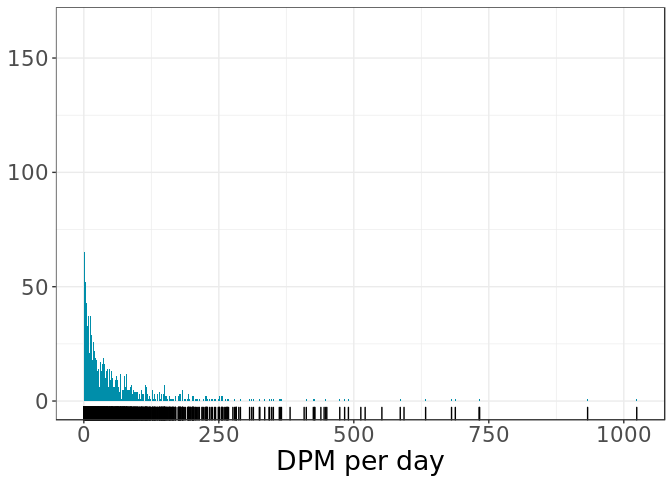

Depending on the research question, there are many more options for exploration of the data! Step 5-7 of Zuur's protocol might be useful when using metadata!
