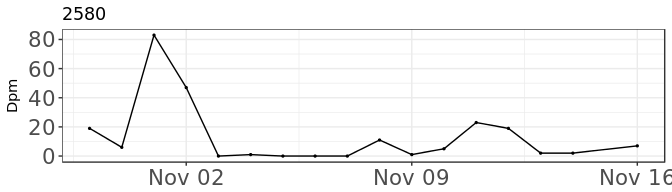

C-POD data workshop: Time series
================
VLIZ - Flanders Marine Institute
October 5-6, 2017

In this topic we will explore temporal data in R in order to visualize the temporal aspect of porpoise distribution. We continue with the data frames created in [C-POD data workshop: Data preparation and exploration]().

1. Dealing with time variables in R
-----------------------------------

As discussed previously, a variable is recognized as time in the POSIxct data type, for example by applying **lubridate::parse\_date\_time()**.

A first step is to plot the value of interest against time.

``` r
ggplot(data = poddata_day, aes(x = Time, y = Dpm)) + 
  theme_bw() +
  theme(axis.text = element_text(size = 16),
        axis.title.x = element_blank()) +
  geom_point(size = 0.5) + geom_line()
```


More relevant is plotting the time series for each zone seperately. This can be done with **facet\_wrap()** or by making a list of plots.

``` r
ggplot(data = poddata_day, aes(x = Time, y = Dpm)) + 
  theme_bw() +
  theme(axis.text = element_text(size = 16),
        axis.title.x = element_blank()) +
  geom_point(size=0.5) + geom_line() + facet_wrap(~Zone, nrow = length(unique(poddata_day$Station)))
```


``` r
lapply(unique(poddata_day$Zone), function(x){
  ggplot(data = poddata_day[poddata_day$Zone == x,], aes(x = Time, y = Dpm)) + 
    theme_bw() +
    theme(axis.text = element_text(size = 16),
          axis.title.x = element_blank()) +
    geom_point(size = 0.5) + geom_line() + ggtitle(x)
})
```


Same can be done for different deployments.

``` r
lapply(unique(poddata_day$Deployment_fk), function(x){
  ggplot(data = poddata_day[poddata_day$Deployment_fk == x,], aes(x = Time, y = Dpm)) + 
    theme_bw() +
    theme(axis.text = element_text(size = 16),
          axis.title.x = element_blank()) +
    geom_point(size = 0.5) + geom_line() + ggtitle(x)
})
```



2. Autocorrelation
------------------

R provides a very easy function to investigate the autocorrelation in your data: acf.

``` r
poddata_day <- arrange(poddata_day, Zone, Time)
acf(poddata_day$Dpm)
```


Again, we are interested in the autocorrelation of each Zone seperately.

``` r
par(mfrow=c(2,2)) # see four plots at a time
lapply(unique(poddata_day$Zone), function(x) {
  data <- acf(poddata_day[poddata_day$Zone == x,]$Dpm, plot = F)
  plot(data, main = x)
})
```


We can also take these values and combine them in one plot.

``` r
lacf <- lapply(unique(poddata_day$Zone), function(x){
  o <- filter(poddata_day, Zone == x)
  oa <- acf(o$Dpm)
  dfo <- data.frame(acf = oa$acf[,,1], lag = oa$lag[,,1], Zone = x)
})
library(plyr) # Now we use the package plyr to make a dataframe out of our list
dacf <- ldply(lacf, rbind)
```

``` r
ggplot(dacf) + geom_path(aes(x=lag, y=acf, group=Zone)) + theme_bw()
```


3. Smoothing
------------

The goal of smoothing is generally to aid visual interpretation of a time series. Let's try on two subsets of our data.

``` r
test1 <- filter(poddata_day, Deployment_fk == 2578)
test2 <- filter(poddata_day, Deployment_fk == 2585)
```

Applying geom\_smooth() plots a loess smoother (weighted regression) on the series.

``` r
ggplot(data = test1, aes(x = Time, y = Dpm)) + theme_bw() +
  geom_point(size = 0.5) + geom_line() + geom_smooth() + ggtitle(2578)
```


``` r
ggplot(data = test2, aes(x = Time, y = Dpm)) + theme_bw() + 
  geom_point(size = 0.5) + geom_line() + geom_smooth() + ggtitle(2585)
```


Another way to smooth data, is to calculate a moving average.

``` r
acf(test1$Dpm) # First, we check the autocorrelation to choose our window size.
```


``` r
library(pastecs)
```

    ## 
    ## Attaching package: 'pastecs'

    ## The following objects are masked from 'package:dplyr':
    ## 
    ##     first, last

``` r
movavg <- decaverage(test1$Dpm, order = 3) # By choosing an order of 3, a window size of 7 will be obtained (3 values to the left, 3 to the right).
movavg # movavg is a list
```

    ##  Call:
    ##  decaverage(x = test1$Dpm, order = 3)
    ## 
    ## Components
    ## [1] "filtered"  "residuals"

``` r
plot(movavg)
```


Now in **ggplot**:

``` r
test1$decavg <- data.frame(movavg$series)$filtered
```

``` r
ggplot(test1, aes(x = Time, y = Dpm)) + geom_point(size = 0.5) + geom_line() + 
  geom_path(aes(y = decavg), size= 1.2, colour = "red") + theme_bw()
```


``` r
movavg <- decaverage(test1$Dpm, order = 3, times = 5)
test1$decavg <- data.frame(movavg$series)$filtered
```

``` r
ggplot(test1, aes(x = Time, y = Dpm)) + geom_point(size = 0.5) + geom_line() + 
  geom_path(aes(y = decavg), size= 1.2, colour = "red") + theme_bw()
```


Now, we can do the same for the other subset.

``` r
acf(test2$Dpm)
```


``` r
movavg <- decaverage(test2$Dpm, order = 1, times = 5)
test2$decavg <- data.frame(movavg$series)$filtered
```

``` r
ggplot(test2, aes(x = Time, y = Dpm)) + geom_point(size = 0.5) + geom_line() + 
  geom_path(aes(y = decavg), size= 1.2, colour = "red") + theme_bw()
```


Discussion: which smoothing technique is preferred? Is smoothing necessary?
