C-POD data workshop: Mapping
================
VLIZ - Flanders Marine Institute
October 5-6, 2017

In this topic we will explore spatial data in R in order to visualize the spatial aspect of porpoise distribution.Besides the generic R functions, there are many specialized [packages](https://cran.r-project.org/web/views/Spatial.html) to visualize and analyze spatial data.

1. Making a map of the BPNS
===========================

Combining **ggplot** with the R packages that facilitate the handling of geospatial data, as [maptools](https://cran.r-project.org/web/packages/maptools/maptools.pdf), [rgdal](https://cran.r-project.org/web/packages/rgdal/rgdal.pdf), [rgeos](https://cran.r-project.org/web/packages/rgeos/rgeos.pdf) and [mapproj](https://cran.r-project.org/web/packages/mapproj/mapproj.pdf), enables the construction of simple and complex maps.

``` r
library(maptools)
library(rgdal)
library(rgeos)
library(mapproj)
```

Using these packages we will construct a simple map of the Belgian Part of the North Sea (BPNS).

1.1 Read shapefiles
-------------------

A common data format for geospatial data is the shapefile. In a shapefile, geospatial data are described as points, lines and polygons and can be analysed as such in GIS software. [Marine Regions](http://www.marineregions.org/) provides access to many shapefiles through the [gazetteer](http://www.marineregions.org/gazetteer.php?p=search). The folder **Mapping** contains some useful shapefiles.

``` r
list.files("Data/Mapping")
```

    ## [1] "banks"             "CoastalBanks"      "eez"              
    ## [4] "Hinder banks"      "netherlands_coast" "world_bay_gulf"   
    ## [7] "Zeeland banks"

The world\_bay\_gulf folder and file contains the shapefile of the [Southern Bight](http://www.marineregions.org/gazetteer.php?p=details&id=2399). Below you can find three ways to import it into the R Environment. The **readShapePoly()** function is one of many to read spatial data. This particular function of the **maptools** package already specifies this particular shapefile is a polygon. The recommended **readOGR()** recognizes the type of spatial data automatically.

``` r
bight <- readShapePoly("Data/Mapping/world_bay_gulf/world_bay_gulf.shp")
```

    ## Warning: use rgdal::readOGR or sf::st_read

``` r
bight <- readOGR("Data/Mapping/world_bay_gulf/world_bay_gulf.shp")
```

    ## OGR data source with driver: ESRI Shapefile 
    ## Source: "/data/home/jolieng/CPOD_data_analysis_workshop/Data/Mapping/world_bay_gulf/world_bay_gulf.shp", layer: "world_bay_gulf"
    ## with 1 features
    ## It has 5 fields

``` r
bight <- readOGR("Data/Mapping/world_bay_gulf", layer = "world_bay_gulf")
```

    ## OGR data source with driver: ESRI Shapefile 
    ## Source: "/data/home/jolieng/CPOD_data_analysis_workshop/Data/Mapping/world_bay_gulf", layer: "world_bay_gulf"
    ## with 1 features
    ## It has 5 fields

Looking at the class, structure and plot of the shapefile allows to better understand the data type.

``` r
class(bight)
```

    ## [1] "SpatialPolygonsDataFrame"
    ## attr(,"package")
    ## [1] "sp"

``` r
str(bight)
```

``` r
plot(bight)
```

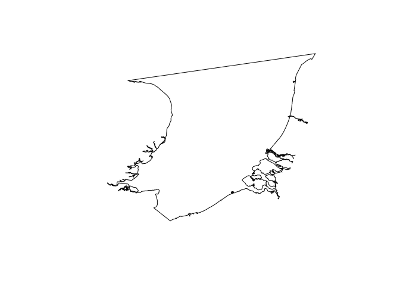

1.2 Plot spatial data in ggplot
-------------------------------

The **fortify()** function allows to easily convert an object of a spatial class to a regular dataframe. Though this transformation is not necessary for making a map in R, it is vital to map data in **ggplot**.

``` r
bightfort <- fortify(bight)
```

``` r
str(bightfort)
```

    ## 'data.frame':    25290 obs. of  7 variables:
    ##  $ long : num  4.99 4.99 4.97 4.97 4.96 ...
    ##  $ lat  : num  52.4 52.4 52.4 52.4 52.4 ...
    ##  $ order: int  1 2 3 4 5 6 7 8 9 10 ...
    ##  $ hole : logi  FALSE FALSE FALSE FALSE FALSE FALSE ...
    ##  $ piece: Factor w/ 64 levels "1","2","3","4",..: 1 1 1 1 1 1 1 1 1 1 ...
    ##  $ id   : chr  "0" "0" "0" "0" ...
    ##  $ group: Factor w/ 64 levels "0.1","0.2","0.3",..: 1 1 1 1 1 1 1 1 1 1 ...

Now, let's start exploring these spatial data with **ggplot**! In order to plot the Southern Bight, we want a plot that connects the different points in our fortified data frame.

``` r
ggplot() + geom_path(data = bightfort, aes(x = long, y = lat))
```

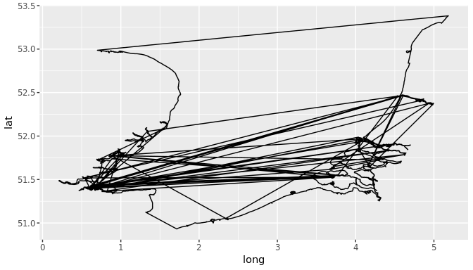

This first try seems slightly demotivating! However, the issue is easily fixed! When fortifying your spatial data, the new data frame will group certain points. It is therefore important to maintain this grouping of the data, simply by telling **ggplot** *group = group*.

``` r
ggplot() + geom_path(data = bightfort, aes(x = long, y = lat, group = group))
```

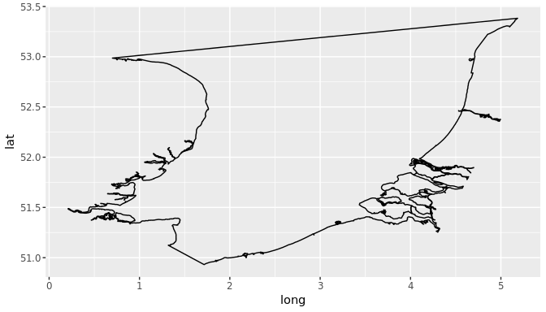

1.3 Add layers to the plot
--------------------------

Now, we can add more information on this plot.The Belgian EEZ for example.

``` r
eez <- readOGR("Data/Mapping/eez/eez.shp")
eezfort <- fortify(eez)
ggplot() + 
  geom_path(data = bightfort, aes(x = long, y = lat, group = group)) +
  geom_path(data = eezfort, aes(x = long, y = lat, group = group))
```

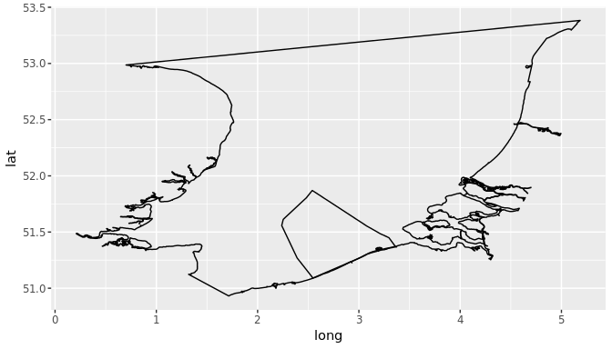

So now we read the EEZ shapefile, transformed it to a dataframe and simply added it to our plot with **geom\_path()**. Be careful always to define x as longitude and y as latitude!

With **coord\_map()**, R recognizes the plot is a map and will scale the dimensions of the axex correctly.

``` r
ggplot() + 
  coord_map() +
  geom_path(data = bightfort, aes(x = long, y = lat, group = group)) +
  geom_path(data = eezfort, aes(x = long, y = lat, group = group))
```

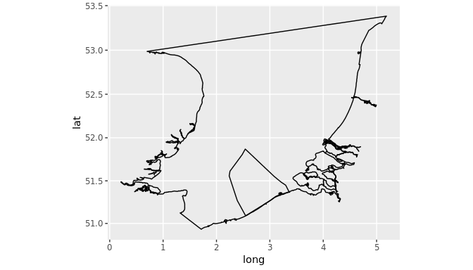

You can also define the limits of the axes with **coord\_map()**.

``` r
ggplot() + 
  coord_map(xlim = c(2,3.5), ylim = c(51,52)) +
  geom_path(data = bightfort, aes(x = long, y = lat, group = group)) +
  geom_path(data = eezfort, aes(x = long, y = lat, group = group))
```

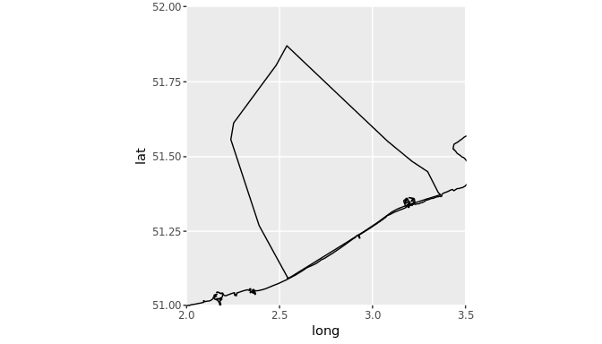

Themes in R allow for prettier maps! The black and white theme can be applied with **theme\_bw()**.

``` r
ggplot() + 
  theme_bw() +
  theme(panel.background = element_rect(fill = "#0093b4"),
        panel.grid.major = element_line(linetype = "blank"),
        panel.grid.minor = element_line(linetype = "blank"),
        axis.title = element_blank(),
        axis.text = element_text(size = 16)) +
  coord_map(xlim = c(2,3.5), ylim = c(51,52)) +
  geom_path(data = bightfort, aes(x = long, y = lat, group = group)) +
  geom_path(data = eezfort, aes(x = long, y = lat, group = group))
```

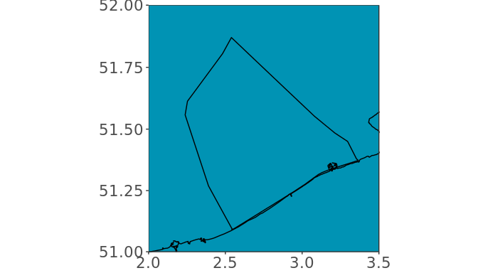

Using **theme()**, a number of lay-out features of a plot can be determined. In the code above, we determined the background colour, removed the grid lines, removed the axis titles and changed the font size of the axis text. The numerous options for the use of the **theme()** function are documented [here](http://ggplot2.tidyverse.org/reference/theme.html).

The background colour was defined here with a colour code. However, *fill = "blue"* would also work. More info on colours in R can be found in this useful [cheatsheet](https://www.nceas.ucsb.edu/~frazier/RSpatialGuides/colorPaletteCheatsheet.pdf) and in this [catalogue](http://www.stat.columbia.edu/~tzheng/files/Rcolor.pdf).

``` r
ggplot() + 
  theme_bw() +
  theme(panel.background = element_rect(fill = "#0093b4"),
        panel.grid.major = element_line(linetype = "blank"),
        panel.grid.minor = element_line(linetype = "blank"),
        axis.title = element_blank(),
        axis.text = element_text(size = 16)) +
  coord_map(xlim = c(2,3.5), ylim = c(51,52)) +
  geom_polygon(aes(x=long, y=lat, group=group), data = bightfort, fill = "white") +
  geom_path(data = bightfort, aes(x = long, y = lat, group = group)) +
  geom_path(data = eezfort, aes(x = long, y = lat, group = group))
```

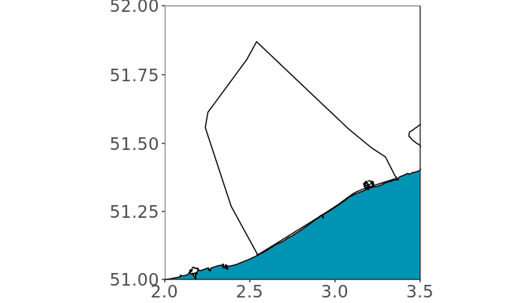

When we define the colour (fill, possible confusion!) of the sea as "white", we see there is an issue with Zeeland on our map. Apparently the shapefile does recognize the points of the peninsula to be part of the Southern Bight (and can draw a path between them), but it does not group them correctly. A possible solution involves the import of a file describing the coast of the Netherlands.

``` r
netherlands_coast <- readOGR("Data/Mapping/netherlands_coast/world_countries_coasts.shp")
netherlands_coastfort <- fortify(netherlands_coast)
ggplot() + 
  theme_bw() +
  theme(panel.background = element_rect(fill = "#0093b4"),
        panel.grid.major = element_line(linetype = "blank"),
        panel.grid.minor = element_line(linetype = "blank"),
        axis.title = element_blank(),
        axis.text = element_text(size = 16)) +
  coord_map(xlim = c(2,3.5), ylim = c(51,52)) +
  geom_polygon(aes(x=long, y=lat, group=group), data = bightfort, fill = "white") +
  geom_polygon(aes(x=long, y=lat, group=group), data = netherlands_coastfort, fill = "#0093b4") +
  geom_path(data = bightfort, aes(x = long, y = lat, group = group)) +
  geom_path(data = eezfort, aes(x = long, y = lat, group = group))
```

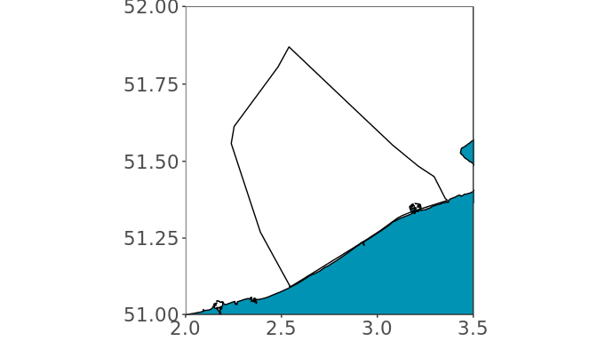

Land and sea are now in a different colour! However, the map is still quite sober. Next up: let's add sand banks!

``` r
banks <- readOGR("Data/Mapping/banks/banks.shp")
banksfort <- fortify(banks)
ggplot() + 
  theme_bw() +
  theme(panel.background = element_rect(fill = "#0093b4"),
        panel.grid.major = element_line(linetype = "blank"),
        panel.grid.minor = element_line(linetype = "blank"),
        axis.title = element_blank(),
        axis.text = element_text(size = 16)) +
  coord_map(xlim = c(2,3.5), ylim = c(51,52)) +
  geom_polygon(aes(x=long, y=lat, group=group), data = bightfort, fill = "white") +
  geom_polygon(aes(x=long, y=lat, group=group), data = netherlands_coastfort, fill = "#0093b4") +
  geom_path(data = bightfort, aes(x = long, y = lat, group = group)) +
  geom_path(data = eezfort, aes(x = long, y = lat, group = group)) +
  geom_polygon(aes(x=long, y=lat, group=group), data = banksfort, fill = "#016483")
```

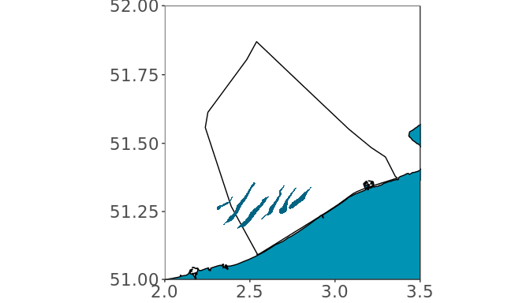

Including sand banks in our map facilitates orientation and is also prettier. Note that the order of **geom\_** arguments matters: the banks are now on top of the EEZ. Let's add some more sand banks!

``` r
bankszeeland <- readOGR("Data/Mapping/Zeeland banks/banks.shp")
bankscoastal <- readOGR("Data/Mapping/CoastalBanks/banks.shp")
bankshinder <- readOGR("Data/Mapping/Hinder banks/banks.shp")
bankszeelandfort <- fortify(bankszeeland)
bankscoastalfort <- fortify(bankscoastal)
bankshinderfort <- fortify(bankshinder)

ggplot() + 
  theme_bw() +
  theme(panel.background = element_rect(fill = "#0093b4"),
        panel.grid.major = element_line(linetype = "blank"),
        panel.grid.minor = element_line(linetype = "blank"),
        axis.title = element_blank(),
        axis.text = element_text(size = 16)) +
  coord_map(xlim = c(2,3.5), ylim = c(51,52)) +
  geom_polygon(aes(x=long, y=lat, group=group), data = bightfort, fill = "white") +
  geom_polygon(aes(x=long, y=lat, group=group), data = netherlands_coastfort, fill = "#0093b4") +
  geom_path(data = bightfort, aes(x = long, y = lat, group = group)) +
  geom_path(data = eezfort, aes(x = long, y = lat, group = group)) +
  geom_polygon(aes(x=long, y=lat, group=group), data = banksfort, fill = "#016483") +
  geom_polygon(aes(x=long, y=lat, group=group), data = bankszeelandfort, fill = "#016483") +
  geom_polygon(aes(x=long, y=lat, group=group), data = bankscoastalfort, fill = "#016483") +
  geom_polygon(aes(x=long, y=lat, group=group), data = bankshinderfort, fill = "#016483")
```

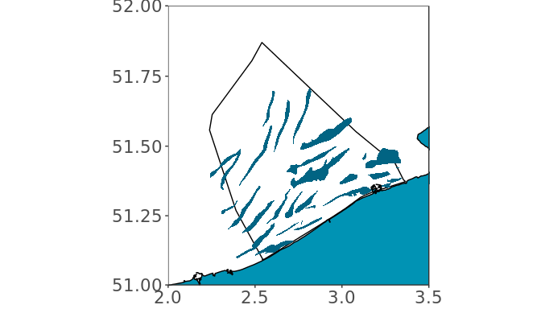

We now have a simple map of the BPNS (with some nice VLIZ colours)! This code for making the map is neither the only, neither the best way, but it provides a simple outline for future reference!

1.4 Compile the code to construct the map in a function
-------------------------------------------------------

We can join all this code in a function to load all shape files and plot the map.

``` r
load_shapes_plot_map <- function() {
  banks <- readOGR("Data/Mapping/banks/banks.shp")
  eez <- readOGR("Data/Mapping/eez/eez.shp")
  bight <- readOGR("Data/Mapping/world_bay_gulf/world_bay_gulf.shp")
  bankszeeland <- readOGR("Data/Mapping/Zeeland banks/banks.shp")
  bankscoastal <- readOGR("Data/Mapping/CoastalBanks/banks.shp")
  bankshinder <- readOGR("Data/Mapping/Hinder banks/banks.shp")
  netherlands_coast <- readOGR("Data/Mapping/netherlands_coast/world_countries_coasts.shp")

  eezfort <- fortify(eez)
  banksfort <- fortify(banks)
  bightfort <- fortify(bight)
  bankszeelandfort <- fortify(bankszeeland)
  bankscoastalfort <- fortify(bankscoastal)
  bankshinderfort <- fortify(bankshinder)
  netherlands_coastfort <- fortify(netherlands_coast)
  netherlands_coastfort <- filter(netherlands_coastfort, lat >51.36)

  ggplot() + 
    coord_map(xlim = c(2,3.5), ylim = c(51,52)) + #important! this makes that the polygons are ok
    theme_bw() +
    theme(panel.background = element_rect(fill = "#0093b4"),
          panel.grid.major = element_line(linetype = "blank"),
          panel.grid.minor = element_line(linetype = "blank"),
          axis.title = element_blank(),
          axis.text = element_text(size = 16)) +
    geom_polygon(aes(x=long, y=lat, group=group), data = bightfort, fill = "white") +
    geom_polygon(aes(x=long, y=lat, group=group), data = netherlands_coastfort, fill = "#0093b4") +  
    geom_path(aes(x=long, y=lat, group=group), data = bightfort) +
    geom_polygon(aes(x=long, y=lat, group=group), data = banksfort, fill = "#016483") +
    geom_polygon(aes(x=long, y=lat, group=group), data = bankszeelandfort, fill = "#016483") +
    geom_polygon(aes(x=long, y=lat, group=group), data = bankscoastalfort, fill = "#016483") +
    geom_polygon(aes(x=long, y=lat, group=group), data = bankshinderfort, fill = "#016483") +
    geom_path(aes(x=long, y=lat), data = eezfort, colour = "black")
}
```

**load\_shapes\_plot\_map()** now makes our map with only one line of code!

``` r
load_shapes_plot_map()
```


You can also load all shapefiles in the environment and construct the map seperately. This might be the favoured option when you plot several maps.

``` r
banks <- readOGR("Data/Mapping/banks/banks.shp")
eez <- readOGR("Data/Mapping/eez/eez.shp")
bight <- readOGR("Data/Mapping/world_bay_gulf/world_bay_gulf.shp")
bankszeeland <- readOGR("Data/Mapping/Zeeland banks/banks.shp")
bankscoastal <- readOGR("Data/Mapping/CoastalBanks/banks.shp")
bankshinder <- readOGR("Data/Mapping/Hinder banks/banks.shp")
netherlands_coast <- readOGR("Data/Mapping/netherlands_coast/world_countries_coasts.shp")

eezfort <- fortify(eez)
banksfort <- fortify(banks)
bightfort <- fortify(bight)
bankszeelandfort <- fortify(bankszeeland)
bankscoastalfort <- fortify(bankscoastal)
bankshinderfort <- fortify(bankshinder)
netherlands_coastfort <- fortify(netherlands_coast)
netherlands_coastfort <- filter(netherlands_coastfort, lat >51.36)

plot_map <- function() {
  ggplot() + 
    coord_map(xlim = c(2,3.5), ylim = c(51,52)) +
    theme_bw() +
    theme(panel.background = element_rect(fill = "#0093b4"),
          panel.grid.major = element_line(linetype = "blank"),
          panel.grid.minor = element_line(linetype = "blank"),
          axis.title = element_blank(),
          axis.text = element_text(size = 16)) +
    geom_polygon(aes(x=long, y=lat, group=group), data = bightfort, fill = "white") +
    geom_polygon(aes(x=long, y=lat, group=group), data = netherlands_coastfort, fill = "#0093b4") +  
    geom_path(aes(x=long, y=lat, group=group), data = bightfort) +
    geom_polygon(aes(x=long, y=lat, group=group), data = banksfort, fill = "#016483") +
    geom_polygon(aes(x=long, y=lat, group=group), data = bankszeelandfort, fill = "#016483") +
    geom_polygon(aes(x=long, y=lat, group=group), data = bankscoastalfort, fill = "#016483") +
    geom_polygon(aes(x=long, y=lat, group=group), data = bankshinderfort, fill = "#016483") +
    geom_path(aes(x=long, y=lat), data = eezfort, colour = "black")
}
```

``` r
plot_map()
```


2. Plot the station locations on the map
========================================

First off, we group our station data in a new data frame stationdf. *%&gt;%* creates a "pipeline" of code. This is an other way of formulating the combination of code to summarize a data frame.

``` r
stationdf <- group_by(poddata_day, Station) %>% summarise(Latitude = max(Latitude), Longitude = max(Longitude))
```

Using *plot\_map*, we can explore the location of the stations in our data.

``` r
plot_map() + geom_point(data = stationdf, aes(Longitude,Latitude), size = 4, colour = "red")
```

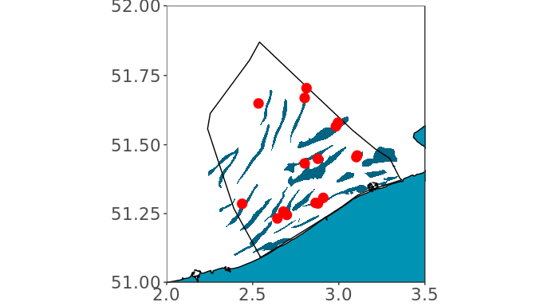

Now, we can add the station names.

``` r
plot_map() + geom_point(data = stationdf, aes(Longitude,Latitude), size = 4, colour = "red") + 
  geom_label(data = stationdf, aes(Longitude +0.01,Latitude,label = Station), hjust = 0)
```

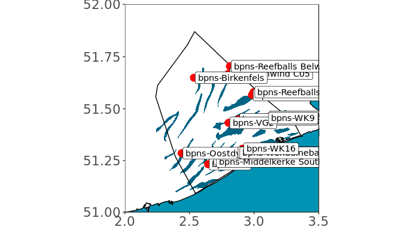

This is very messy... By using the package [ggrepel](https://cran.r-project.org/web/packages/ggrepel/ggrepel.pdf), you can avoid overlapping labels or text.

``` r
library(ggrepel)
```

``` r
plot_map() + geom_point(data = stationdf, aes(Longitude,Latitude), size = 4, colour = "red") + 
  geom_label_repel(data = stationdf, aes(Longitude +0.01,Latitude,label = Station))
```

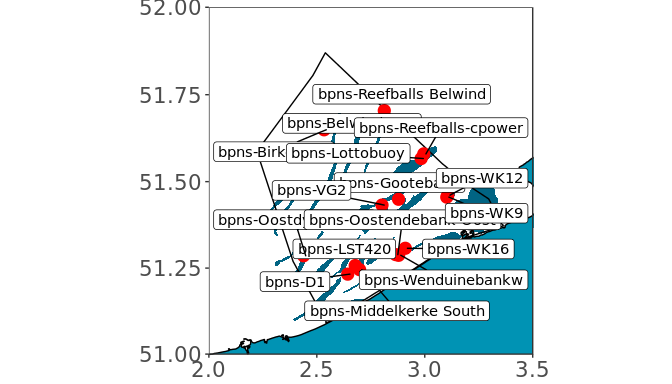

**geom\_label\_repel()** does the job, but our plot is still a bit messy. We can try to plot zones instead.

``` r
zonedf <- group_by(poddata_day, Zone) %>% summarise(Latitude = mean(Latitude), Longitude = mean(Longitude))
```

``` r
plot_map() + geom_point(data = zonedf, aes(Longitude,Latitude), size = 4, colour = "red") + 
  geom_label_repel(data = zonedf, aes(Longitude +0.01,Latitude,label = Zone))
```

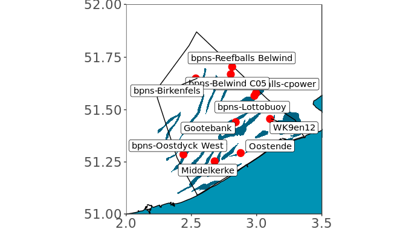

3. Spatial data exploration
===========================

In order to plot detection related variables spatially, we first summarise them for each zone.

``` r
zonedf <- group_by(poddata_day, Zone) %>% 
  summarise(Latitude = mean(Latitude), 
            Longitude = mean(Longitude),
            Milliseconds = mean(Milliseconds),
            Number_clicks_filtered = mean(Number_clicks_filtered),
            Number_clicks_total = mean(Number_clicks_total),
            Lost_minutes = mean(Lost_minutes),
            Dpm = sum(Dpm),
            Dp10m = sum(Dp10m),
            Dph = sum(Dph),
            Recorded = sum(Recorded))
zonedf$Click_frequency <- zonedf$Dpm/zonedf$Recorded
zonedf$Click_intensity <- zonedf$Number_clicks_filtered/zonedf$Click_frequency
```

3.1 Mapping detections
----------------------

``` r
plot_map() + geom_point(data = zonedf, aes(Longitude,Latitude, size = Milliseconds), colour = "red")
```

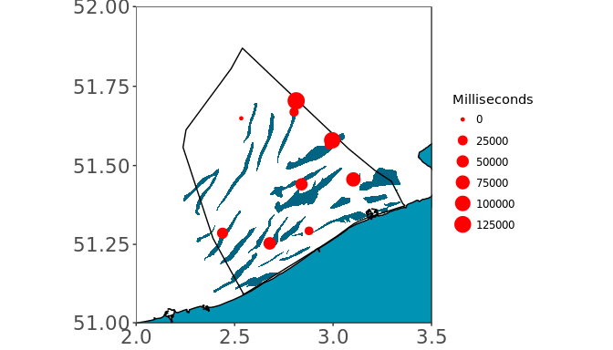

``` r
plot_map() + geom_point(data = zonedf, aes(Longitude,Latitude, size = Number_clicks_filtered), colour = "red")
```

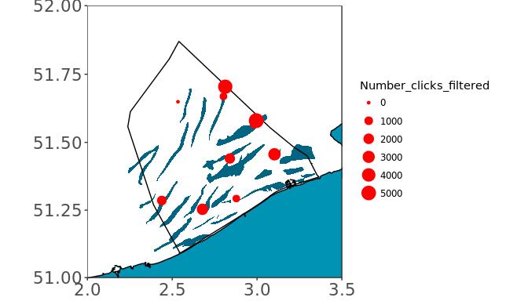

``` r
plot_map() + geom_point(data = zonedf, aes(Longitude,Latitude, size = Dpm), colour = "red")
```

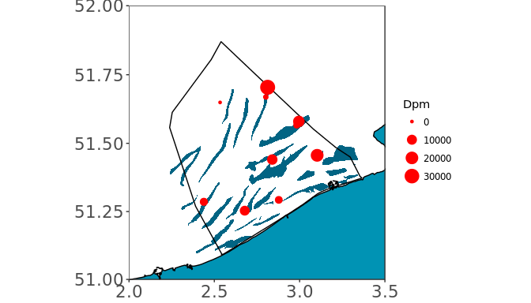

``` r
plot_map() + geom_point(data = zonedf, aes(Longitude,Latitude, size = Dp10m), colour = "red")
```

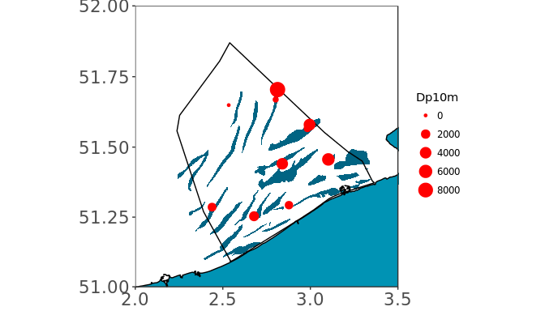

``` r
plot_map() + geom_point(data = zonedf, aes(Longitude,Latitude, size = Dph), colour = "red")
```

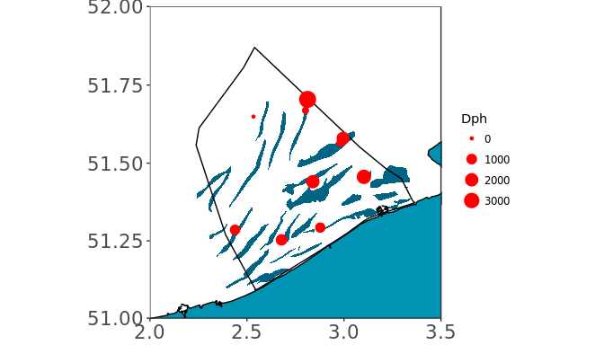

``` r
plot_map() + geom_point(data = zonedf, aes(Longitude,Latitude, size = Click_frequency), colour = "red")
```

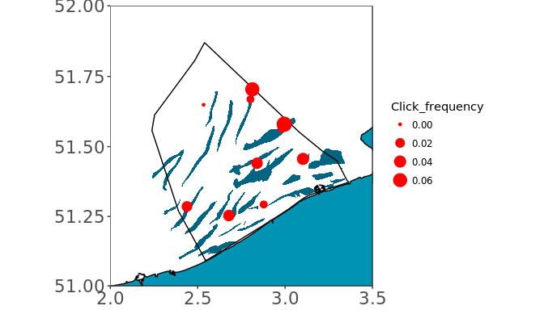

``` r
plot_map() + geom_point(data = zonedf, aes(Longitude,Latitude, size = Click_intensity), colour = "red")
```

    ## Warning: Removed 1 rows containing missing values (geom_point).

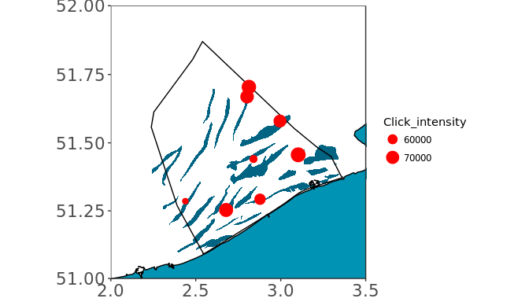

An alternative to first grouping and summarizing the data, is to use the *group* argument in **ggplot**.

``` r
plot_map() + geom_point(data = poddata_day, aes(Longitude,Latitude, size = Click_frequency, group=Zone), colour = "red")
```

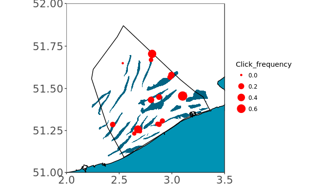

3.2 Visualize spatiotemporal patterns
-------------------------------------

In order to get an idea of the porpoise distribution each month, we first summarize the data per zone and month.

``` r
zonedf <- group_by(poddata_day, Zone, month(Time)) %>% 
  summarise(Latitude = mean(Latitude), 
            Longitude = mean(Longitude),
            Milliseconds = mean(Milliseconds),
            Number_clicks_filtered = mean(Number_clicks_filtered),
            Number_clicks_total = mean(Number_clicks_total),
            Lost_minutes = mean(Lost_minutes),
            Dpm = sum(Dpm),
            Dp10m = sum(Dp10m),
            Dph = sum(Dph),
            Recorded = sum(Recorded))
zonedf$Click_frequency <- zonedf$Dpm/zonedf$Recorded
zonedf$Click_intensity <- zonedf$Number_clicks_filtered/zonedf$Click_frequency
colnames(zonedf)[2] <- "Month"
```

We can now visualize the distribution pattern per month.

``` r
plot_map() + geom_point(data = zonedf[zonedf$Month == 1,], aes(Longitude,Latitude, size = Click_frequency), colour = "red") + ggtitle(1)
```

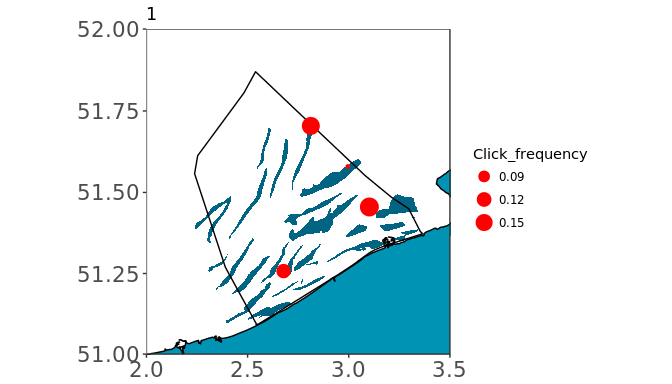

Instead of making 12 plots in 12 lines of code, we can make a list of plots.

``` r
par(mfrow=c(2,2))
lapply(unique(zonedf$Month), function(x){
  plot_map() + geom_point(data = zonedf[zonedf$Month == x,], aes(Longitude,Latitude, size = Click_frequency), colour = "red") + ggtitle(x)
})
```

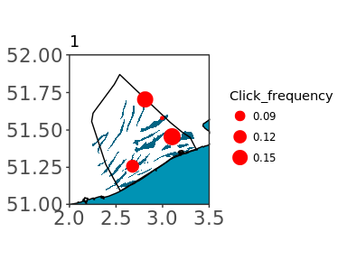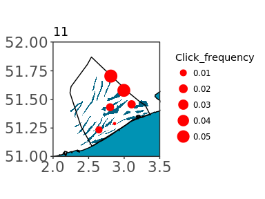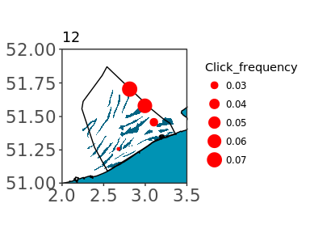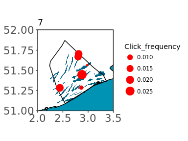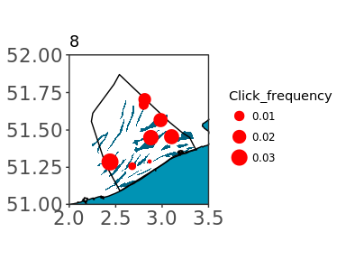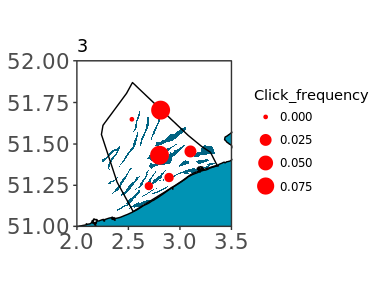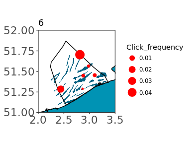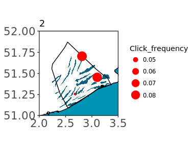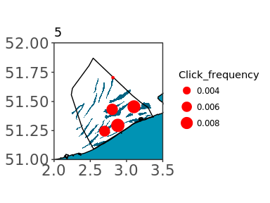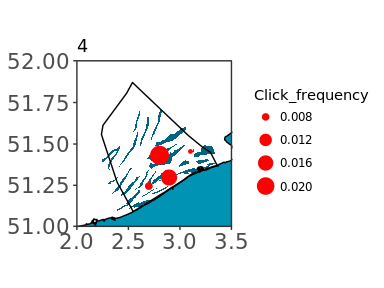

An easy alternative to plot in chronological order:

``` r
par(mfrow=c(2,2))
lapply(1:12, function(x){
  plot_map() + geom_point(data = zonedf[zonedf$Month == x,], aes(Longitude,Latitude, size = Click_frequency), colour = "red") + ggtitle(x)
})
```


In order to have the results of the 12 months displayed in one plot, we can apply **facet\_wrap()**.

``` r
plot_map() + geom_point(data = zonedf, aes(Longitude,Latitude, size = Click_frequency), colour = "red") + facet_wrap(~Month)
```

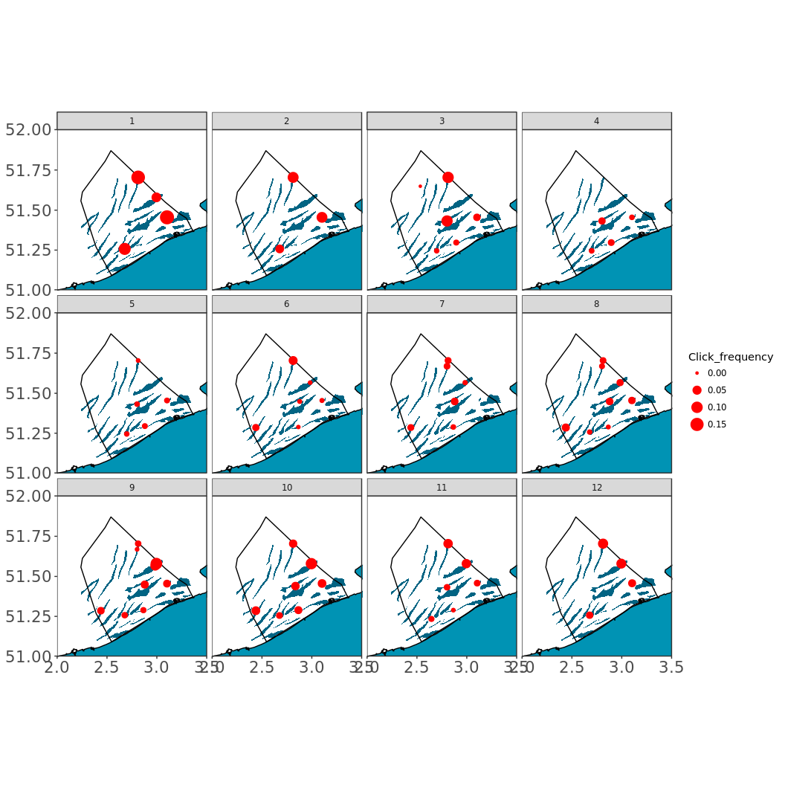
